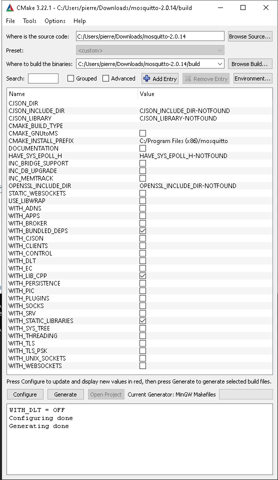

# WxTest Mqtt

Basic ranking c++17 wxWidget App starter kit.  
[wxWidget](https://www.wxwidgets.org/) GUI lib is cross-platform compliant.  
This branch(mqtt) let app to pubsub through mqtt, up to you to change topics according to your requirements.  

## Screenshots

### UI


### Log


## Components

App uses :

* **wxApp** ready for wxGetApp feature as singleton pattern.
* **wxLog** as file logger with efficient log level managment.
* **wxFrame** inherited as single frame design.
* **wxPanel** multiple panels used by **wxSplitter**.
* **wxSplitter** & **wxSiser** for h/v auto layout adjustments.
* **wxCommandEvent** subclassing for custom event design (MyMqttEvent).
* **wxListCtrl** for list management with XPM icons design.
* **wxTimer** for timestamp management.
* Most common widgets like wxMenuBar,wxMenu,wxStatusBar,wxButton,wxRadio,etc... 

## Requirements

### Compiler
* g++

### wxWidget
wWidget dev library (3.0) and above.
### Debian 9 wxWidget 3.0 Gtk2
* Check installed version on debian (stretch with Gtk2).

```
dpkg -l | grep 'wxWidget' | grep dev
```

* Check all wWidget available dev lib to be installed.

```
apt-cache search 'wxWidget' | grep dev
```

* Minimal install on debian.

```
sudo apt-get install libwxbase3.0-dev libwxgtk-media3.0-dev libwxgtk3.0-dev  
```

### Debian 11 wxWidget 3.1.5 Gtk3

After migrating from stretch to bullseye compilation worked but link failed.  
To fix this issue :
* Download sources [wxWidget 3.1.5](https://www.wxwidgets.org/downloads/).
* Follow [setup instructions](https://www.binarytides.com/install-wxwidgets-ubuntu/).
* Before checkinstall run :
```
sudo mkdir -p /usr/local/lib/wx \
	/usr/local/lib/wx/include \
	/usr/local/share/bakefile \
	/usr/local/lib/wx/include/gtk3-unicode-3.1
```


#### Check verify
Go to [HelloWorldExample](https://docs.wxwidgets.org/3.0/overview_helloworld.html),copy paste in a main.cpp file the full code exmaple then run :
```
g++ main.cpp -o prog `wx-config --cppflags` `wx-config --libs`
```
Build should be done without errors then run :
```
./prog
```
This should start HelloWorld App.

### Mqtt

#### Requirements

Mosquitto dev lib (mosquittopp) c++ wrapper is required.

```
sudo apt-get install mosquitto-dev libmosquitto-dev libmosquittopp-dev
```

Thus, a mqtt data broker([Mosquitto](https://mosquitto.org)) is required, change mqtt config in [Mqtt config broker](include/mqttbroker.h) according to your need.  
If you are not using credentials to broker remove them from myMqtt ctor initialization.  
Keep in mind mqtt mid(pseudo) should be unique (one by App instance) otherwise side effects (connect/disconnect) will occur.  
Relevant broker definitions can be found [there](include/mqttbroker.h).    
Mqtt(myMqtt) main class can be found [there](include/mymqtt.h) instanciated by App.  
When mqtt subscription event is triggered we generate a [**MyMqttEvent**](include/mqttevent.h) event sending both topic and payload to the frame.  
We listen to event from frame (topic related) then we apply feature to the matching topic.  
So we keep loose coupling app, mqtt and frame.

#### Topics

(PUB/SUB) : in [topics](./include/mqtttopics.h) definition.  

### Doxygen 
* doc generator.

### Cppcheck 
* C++ code checker.  
* Hereby used with std c++11 but should be c++17.  

## Fixtures

In fixtures folder you can find 2 folders:

* bash : to let you pubsub from bash (change config according to your infra).
* node-red : to load node red script to pubsub according to wxtest topics (change mqtt setup according to your infra).

## Build

### Linux

#### Build app

with wxWidget 2.0 gtk2.  
```
make all
```

with wxWidget 3.1.5 gtk3, require gcc >= 10 .
```
make -f Makefile.315 all
```

#### Debug

Dependecies list
```
ldd ./wxTest
```

Memory leaks check valgrind
```
valgrind --leak-check=full ./wxTest
```

For now i can see error from the sanitizer
```
==2181884==ERROR: LeakSanitizer: detected memory leaks

Direct leak of 43008 byte(s) in 168 object(s) allocated from:
    #0 0x7f4ef269fe8f in __interceptor_malloc ../../../../src/libsanitizer/asan/asan_malloc_linux.cpp:145
    #1 0x7f4eeface704  (/usr/lib/x86_64-linux-gnu/libfontconfig.so.1+0x20704)

Direct leak of 10240 byte(s) in 16 object(s) allocated from:
    #0 0x7f4ef26a01f8 in __interceptor_realloc ../../../../src/libsanitizer/asan/asan_malloc_linux.cpp:164
    #1 0x7f4eeface7b0  (/usr/lib/x86_64-linux-gnu/libfontconfig.so.1+0x207b0)
...
```
But it's not my bad, just an issue with libfontconfig & cairo.  
Check [there](https://github.com/wxWidgets/wxWidgets/blob/master/misc/suppressions/lsan) to set asan options in order to see well known mem leaks.

#### Clean build

```
make clean
```

#### Build doc

```
make doc
```
Doc will be generated in doc/html folder.

#### Clean doc

```
make cleandoc
```

#### Code check

```
make check
```

### Win32

#### Setup dev env

Install [mingw64 from MSYS2 with gcc/g++](https://www.youtube.com/watch?v=aXF4A5UeSeM) package using pacman, by the way start a new pacman for mingw-make to get the mingw32-make command.  

#### Setup wxwidget resources
Download wxwidget prebuild ([Download Windows Binaries](https://www.wxwidgets.org/downloads/)) mathing your arch x86/x86_64 :
* Header Files.
* Development File.
* Release DLLs.  

#### Setup mosquitto resources
Clone sources from [mosquitto on github](https://github.com/eclipse/mosquitto).  
Create a folder build inside the cloned repo.
Install Cmake binary for windows.  
Launch Cmake Gui, point to the mosquitto sources and choose the build target with your build folder.  
Choose mingw as compiler when ask for.  
Uncheck all checkbox checked as below (keep only 3 checked) :



Press buttons configure then generate.  
Once done (without any errors, forget warnings), open a command prompt and go the mosq build folder and run command as below :

```
mingw32-make -f Makefile
```

This will build both required dlls (for runtime) and objects(for linking).  
Copy dlls to your app build folder :

* libmosquittop.dll
* libmosquitto.dll

At this time you should be ready to buid the app as below.  

#### Build app

Edit buildw32.cmd changing :

* the base path for wxwidget.  
* the base path for mosquitto.  

Create a build folder on root project.  
Then run the command below.  
```
buildw32.cmd
```
As non static built 4 dlls required for runtime :  

you should add 2 wxwidget dlls to distribute the runtime :

* wxbase315u_gcc1020_x64.dll
* wxmsw315u_core_gcc1020_x64.dll

Both of them should be found in your wxwidget prebuild.

you should add 2 mosquitto dlls to distribute the runtime :

* libmosquittop.dll
* libmosquitto.dll

## Licence

### Common
* GPLv3.
* Feel free to modify app source and distribute binaries.

### To not infringe GPLv3

* build should be dynamic (no static).
* libs or dependencies used for your release should be externals.

## Test

* Testing UI is evil because most of members and props are privates.
* Separate logic from UI is recommended to achieve this.
* May be using [boost test lib](https://www.boost.org/doc/libs/1_52_0/libs/test/doc/html/index.html) let you doing so.

## Links

* [wxWidget](https://docs.wxwidgets.org/3.0/) doc.
* For Microsoft users, [setup vscode](https://stackoverflow.com/questions/30269449/how-do-i-set-up-visual-studio-code-to-compile-c-code) for cpp project.
* [Mosquitto](https://mosquitto.org/) official.
* [Mqtt](https://www.hivemq.com/blog/mqtt-essentials-part-5-mqtt-topics-best-practices/) best practices.
