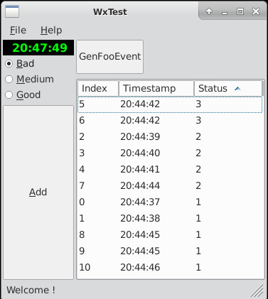
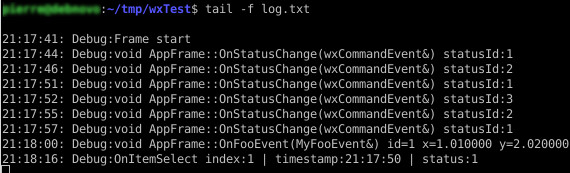

# WxTest Mqtt

Basic ranking c++17 wxWidget App starter kit.  
[wxWidget](https://www.wxwidgets.org/) GUI lib is cross-platform compliant.  
This branch(mqtt) let app to pubsub through mqtt, up to you to change topics according to your requirements.  

## Screenshots

### UI


### Log


## Components

App uses :

* **wxApp** ready for wxGetApp feature as singleton pattern.
* **wxLog** as file logger with efficient log level managment.
* **wxFrame** inherited as single frame design.
* **wxPanel** multiple panels used by **wxSplitter**.
* **wxSplitter** & **wxSiser** for h/v auto layout adjustments.
* **wxCommandEvent** subclassing for custom event design (MyMqttEvent).
* **wxListCtrl** for list management with XPM icons design.
* **wxTimer** for timestamp management.
* Most common widgets like wxMenuBar,wxMenu,wxStatusBar,wxButton,wxRadio,etc... 

## Requirements

### Compiler
* g++

### wxWidget
wWidget dev library (3.0) and above.
* Check installed version on debian.

```
dpkg -l | grep 'wxWidget' | grep dev
```

* Check all wWidget available dev lib to be installed.

```
apt-cache search 'wxWidget' | grep dev
```

* Minimal install on debian.

```
sudo apt-get install libwxbase3.0-dev libwxgtk-media3.0-dev libwxgtk3.0-dev  
```

### Mqtt

Mosquitto dev lib (mosquittopp) c++ wrapper is required.

```
sudo apt-get install mosquitto-dev libmosquitto-dev libmosquittopp-dev
```

Thus, a mqtt data broker([Mosquitto](https://mosquitto.org)) is required, change mqtt config in [App](include/app.h) according to your infrastructure.  
If you are not using credentials to broker remove them from myMqtt ctor initialization.  
Keep in mind mqtt mid(pseudo) should be unique (one by App instance) otherwise side effects (connect/disconnect) will occur.  
For improvement if you decide your app to be remote controlled through mqtt, I would advise to design a new custom event (see [FooEvent](include/fooevent.h) class).  
For instance consider RControlEvent to match your required features then bind controls to this kind of event.   
In that way we keep loose coupling between mqtt and various controls, this also implies to refacto myMqtt class to emit RControlEvent on bus.

#### Pub topics :

* RANK_MQTT_TOPIC_PUBLISH_ITEM "wxwidget/app/state/item"
* APP_FRAME_MQTT_TOPIC_PUBLISH_STATUS "wxwidget/app/state/statusid"

#### Default sub topic :

* APP_MQTT_DEFAULT_TOPICS_SUB "wxwidget/app/#"

### Doxygen 
* doc generator.

### Cppcheck 
* C++ code checker.  
* Hereby used with std c++11 but should be c++17.  

## Fixtures

In fixtures folder you can find 2 folders:

* bash : to let you pubsub from bash (change config according to your infra).
* node-red : to load node red script to pubsub according to wxtest topics (change mqtt setup according to your infra).

## Build

### Build app

```
make
```

### Clean build

```
make clean
```

### Build doc

```
make doc
```
Doc will be generated in doc/html folder.

### Clean doc

```
make cleandoc
```

## Code check

```
make check
```

## Test

* Testing UI is evil because most of members and props are privates.
* Separate logic from UI is recommended to achieve this.
* May be using [boost test lib](https://www.boost.org/doc/libs/1_52_0/libs/test/doc/html/index.html) let you doing so.

## Links

* [wxWidget](https://docs.wxwidgets.org/3.0/) doc.
* For Microsoft users, [setup vscode](https://stackoverflow.com/questions/30269449/how-do-i-set-up-visual-studio-code-to-compile-c-code) for cpp project.
* [Mosquitto](https://mosquitto.org/) official.
* [Mqtt](https://www.hivemq.com/blog/mqtt-essentials-part-5-mqtt-topics-best-practices/) best practices.
